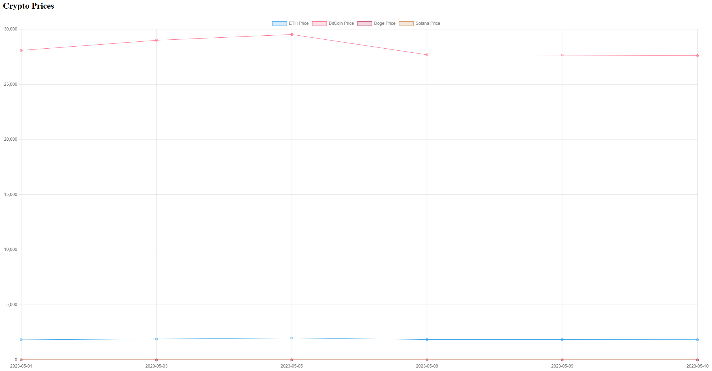
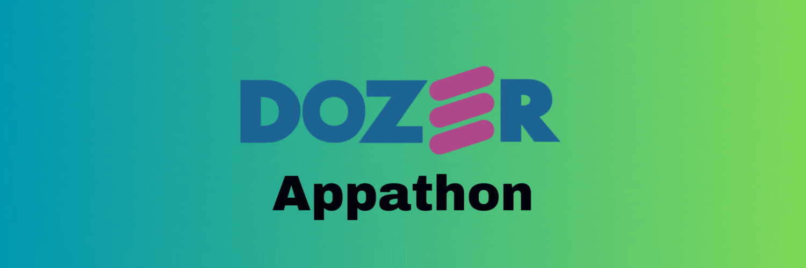

# Introduction

This sample app was developed during the first-ever Dozer Appathon. It was an overwhelming experience to learn and implement all the Dozer functionalities but this app was finally structured in the most simple way that could explore the data caching and data API provisioning features of Dozer.

# About the App

The app is simply an HTML file that is configured with Axios to hit the Dozer endpoint and fetch the required data values. In this context, there's a calendar that a user can use to pick a date and submit it to fetch the Closing price of 4 different Crypto coins (Ethereum, Bitcoin, DOGE, Solana) on that date. The Closing price values are further plotted as a bar chart for better visual representation.

# Working of the App

The main component of this entire app is its `dozer-config.yaml` file. Here, the Postgresql Connector is used and 4 endpoints are exposed, one for each coin. The Database is hosted on DigitalOcean Platform and the Config file has been configured on a DigitalOcean Droplet such that it keeps running 24x7. One can simply open the `index.html` and start playing with it instantly after configuring the host URLs properly.

# Live App

The App has been deployed and is Live at http://64.227.144.5:8080/.
If you wish to try it yourself, then the respective CSV files are also available inside the `data` folder.

