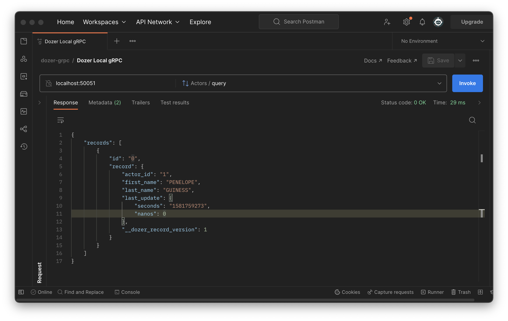

## Dozer Postgres Starter

## Initialization
Refer to [Installation](https://getdozer.io/docs/installation) for instructions.

Download the sample dataset and Postgres schema fro [Pagila](s://github.com/devrimgunduz/pagila).
```bash
./download.sh
```
## Running

Run a sample postgres database on the port `5433`
```
docker-compose up
```

Running Dozer
```
dozer
```

That's all to it. You have APIs instantly available over REST and gRPC.

```
 dozer

____   ___ __________ ____
|  _ \ / _ \__  / ____|  _ \
| | | | | | |/ /|  _| | |_) |
| |_| | |_| / /_| |___|  _ <
|____/ \___/____|_____|_| \_\


Dozer Version: 0.1.11

2023-03-12T10:09:20.046054Z  INFO Starting Rest Api Server on http://0.0.0.0:8080 with security: None
2023-03-12T10:09:20.046217Z  INFO Starting gRPC server on http://0.0.0.0:50051 with security: None
```


### Querying Dozer

**REST**

Filter with limit of 3
```
curl -X POST  http://localhost:8080/films/query \
--header 'Content-Type: application/json' \
--data-raw '{"$limit":3}'
```

```
[
  {"film_id":1,"title":"ACADEMY DINOSAUR","__dozer_record_id":0,"__dozer_record_version":1},
  {"film_id":257,"title":"DRUMLINE CYCLONE","__dozer_record_id":256,"__dozer_record_version":1},
  {"film_id":513,"title":"LEATHERNECKS DWARFS","__dozer_record_id":512,"__dozer_record_version":1}
]
```


**`gRPC`**
Filter with limit of 1
```
grpcurl -d '{"query": "{\"$limit\": 1}"}' \
-plaintext localhost:50051 \
dozer.generated.actors.Actors/query
```
Response
```
{
  "records": [
    {
      "record": {
        "actorId": "1",
        "firstName": "PENELOPE",
        "lastName": "GUINESS",
        "lastUpdate": "2020-02-15T09:34:33Z",
        "DozerRecordVersion": 1
      }
    }
  ]
}
```

Postman




## Dozer Cloud

To deploy Dozer on the cloud, you can use the following steps:

1. Setup your database on a postgres
2. Setup your enviroment variables as mention in .env.sample file
3. Put the details in the `dozer-config.yaml` file
4. Run the following command to start Dozer:

To use environment variables while deploying
```bash
dozer cloud deploy -s POSTGRES_HOST=$POSTGRES_HOST -s POSTGRES_USER=$POSTGRES_USER -s POSTGRES_PASSWORD=$POSTGRES_PASSWORD -s POSTGRES_DATABASE=$POSTGRES_DATABASE
```

4. To query the data

```bash
curl -H "x-dozer-app-id: <app-id>" https://data.dev.getdozer.io:443 ```

