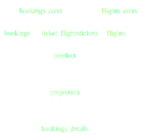

### Dozer Sample - Flight bookings
In this example, Dozer fetches data from multiple Postgres tables and combines them in real time based on the queries and produces fast READ APIs to be used in a flight booking application. 


This pattern is very much applicable even when the data is being fetched across micro services and even from different types of data stores. Check out Dozer documentation for all supported data sources. 

Please check out our blog for a [full explanation](https://getdozer.io/blog/microservices)

### Running 

```
docker-compose up
```

**NOTE**: [Git LFS](https://docs.github.com/en/repositories/working-with-files/managing-large-files/installing-git-large-file-storage) is needed when cloning this sample.

### Schema


### APIs 
| Path                  | Source  | Notes                                                                                          |
| --------------------- | ------- | ---------------------------------------------------------------------------------------------- |
| GET /bookings         | Derived | Booking Listing API. Filters are automatically generated on single columns. Eg: `passenger_id` |
| GET /bookings/details | Derived | Detailed information about a booking including flight information across several stops         |
| GET /routes           | Derived | All routes per day of the week based on all ticket bookings made                               |

### Querying 
Every endpoint generates a `Count` and a `Query` method. Both of these support filter and sort operations. 
`REST` APIs are available on `8080` port and gRPC on `50051` by default.

```
grpcurl -plaintext localhost:50051 dozer.generated.bookings_details.BookingsDetails/count
{
  "count": "185270"
}

grpcurl -plaintext localhost:50051 dozer.generated.routes.Routes/count
{
  "count": "3798"
}

grpcurl -plaintext localhost:50051 dozer.generated.routes.Routes/query

{
  "records": [
    {
      "id": "3093",
      "record": {
        "flightNo": "PG0001",
        "departureAirport": "UIK",
        "arrivalAirport": "SGC",
        "aircraftCode": "CR2",
        "duration": "8400000",
        "daysOfWeek": "5",
        "DozerRecordVersion": 1
      }
    },

    ....

    {
      "id": "406",
      "record": {
        "flightNo": "PG0013",
        "departureAirport": "AER",
        "arrivalAirport": "SVO",
        "aircraftCode": "773",
        "duration": "6300000",
        "daysOfWeek": "5",
        "DozerRecordVersion": 1
      }
    }
  ]
}
```

### Under the hood
Dozer transforms all the queries in dozer-config.yaml into a DAG (Directed Acyclic Graph). The DAG defines the streaming execution of the query where each node is a source, a processor or a sink. Below is, for instance, the generated DAG for the BOOKING DETAILS query. 




The following is a snapshot of counters while running this sample.


### Configuration
Dozer generates end to end date pipeline + APIs just via configuration. Refer to the configuration for [this example here](./dozer-config.yaml)

###  Notes
[Sample data is from here](https://postgrespro.com/docs/postgrespro/10/demodb-bookings-installation)

You can download a bigger data set following the instructions on the above page. 
