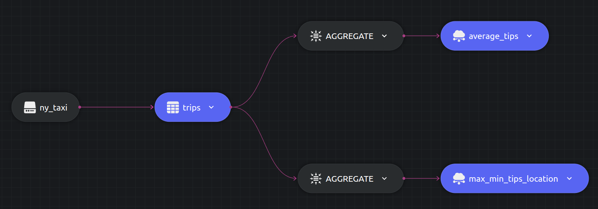

# Aggregation example

This example shows few aggregations operation possible with Dozer. For more information on aggregation operations, head over to the [documentation](https://getdozer.io/docs/transforming-data/aggregation-functions)

Let us write two queries,
- Query to find the average_tips rounded upto two decimal places as well as the total trips made for each Pickup location.

- Query to find the maximum tipped Pickup location as well as the minimum tipped Pickup location.

## SQL Query and Structure

### Query 1

```sql
  SELECT PULocationID, ROUND(AVG(tips),2) as avg_tips, COUNT(1) as trip_count
  INTO table1
  FROM trips
  GROUP BY PULocationID;
```

### Query 2

```sql
  SELECT MAX_VALUE(tips,PULocationID) as max_tipping_location, MIN_VALUE(tips,PULocationID) as min_tipping_location
  INTO table2
  FROM trips;
```




## Running


### Dozer

To run Dozer navigate to the join folder `/sql/join` & use the following command

```bash
dozer run
```

To remove the cache directory, use

```bash
dozer clean
```


### Dozer Live

To run with Dozer live, replace `run` with `live`

```bash
dozer live
```

Dozer live automatically deletes the cache upon stopping the program.


## Querying Dozer 

Dozer API lets us use `filter`,`limit`,`order_by` and `skip` at the endpoints. Execute the following commands over bash to get the results from `REST` and `gRPC` APIs.

### Query 1

For this example lets order the data in descending order of avg_tips.

**`REST`**

```bash
curl -X POST  http://localhost:8080/average_tips/query \
--header 'Content-Type: application/json' \
--data-raw '{"$order_by": {"avg_tips": "desc"}}'
```

**`gRPC`**

```bash
grpcurl -d '{"endpoint": "average_tips", "query": "{\"$order_by\": {\"avg_tips\": \"desc\"}}"}' \
-plaintext localhost:50051 \
dozer.common.CommonGrpcService/query
```

### Query 2

Let us query this data at the endpoints

**`REST`**

```bash
curl -X POST  http://localhost:8080/max_min_tip_location/query \
--header 'Content-Type: application/json' \
--data-raw '{}'
```

**`gRPC`**

```bash
grpcurl -d '{"endpoint": "max_min_tip_location"}' \
-plaintext localhost:50051 \
dozer.common.CommonGrpcService/query
```