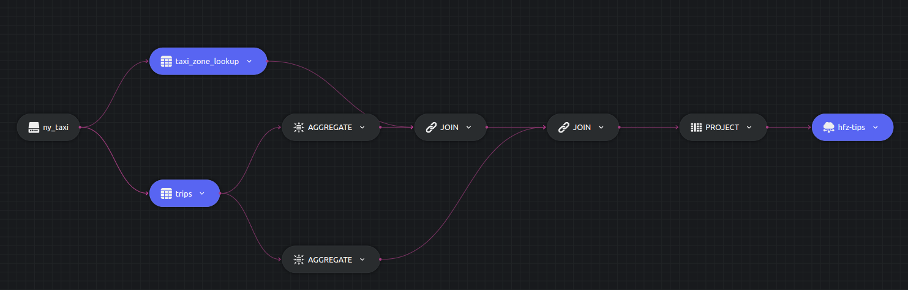

# CTE example

This example shows CTE functions which potentially improve readability, as well as give us the option to reuse queries.

Let us write a query to calculate the average `tips` as well as number of pickups in high frequency zones. Notice how we can have both the CTEs i.e. `good_tip_pickups` & `high_frequency_pickups` in one CTE as well, but this example is meant to describe how to write multiple CTE functions.

## SQL Query and Structure

```sql
 WITH good_tip_pickups AS (
  SELECT PULocationID, avg(tips) as avg_tip
  FROM trips
  GROUP BY PULocationID
  HAVING avg(tips) > 1.00
 ),
 high_frequency_pickups AS (
  SELECT PULocationID, count(1) as trip_count
  FROM trips
  GROUP BY PULocationID
  HAVING count(1) > 100
 )
 SELECT Zone, avg_tip, trip_count
 INTO table1
 FROM taxi_zone_lookup tzl
 JOIN good_tip_pickups gtp ON tzl.LocationID = gtp.PULocationID
 JOIN high_frequency_pickups hfp ON tzl.LocationID = hfp.PULocationID;
```



## Running


### Dozer

To run Dozer navigate to the join folder `/sql/cte` & use the following command

```bash
dozer run
```

To remove the cache directory, use

```bash
dozer clean
```


### Dozer Live

To run with Dozer live, replace `run` with `live`

```bash
dozer live
```

Dozer live automatically deletes the cache upon stopping the program.


## Querying Dozer 

Dozer API lets us use `filter`,`limit`,`order_by` and `skip` at the endpoints. For this example lets order the data in descending order of `avg_tip`.

Execute the following commands over bash to get the results from `REST` and `gRPC` APIs.

**`REST`**

```bash
curl -X POST  http://localhost:8080/hfz-tips/query \
--header 'Content-Type: application/json' \
--data-raw '{"$order_by": {"avg_tip": "desc"}}'
```

**`gRPC`**

```bash
grpcurl -d '{"endpoint": "hfz-tips", "query": "{\"$order_by\": {\"avg_tip\": \"desc\"}}"}' \
-plaintext localhost:50051 \
dozer.common.CommonGrpcService/query
```
