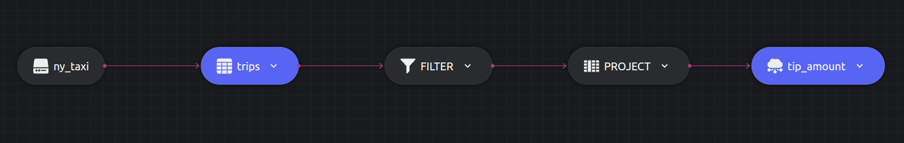

# Filtering example

This example shows how to filter data with the `WHERE` clause in Dozer.

Let us write a query to calculate the `tips` and `trip_miles` for rides that cover more than 100 miles, along with an additional filter which ensures that the result will be for `hvfhs_license_num` ending with `03` only. 

## SQL Query and Structure

```sql
  SELECT tips, trip_miles
  INTO table1
  FROM trips 
  WHERE trip_miles > 100 
  AND hvfhs_license_num LIKE '%03';
```




## Running


### Dozer

To run Dozer navigate to the join folder `/sql/filter` & use the following command

```bash
dozer run
```

To remove the cache directory, use

```bash
dozer clean
```


### Dozer Live

To run with Dozer live, replace `run` with `live`

```bash
dozer live
```

Dozer live automatically deletes the cache upon stopping the program.


## Querying Dozer 

Dozer API lets us use `filter`,`limit`,`order_by` and `skip` at the endpoints. For this example lets order the data in descending order of `tips`.

Execute the following commands over bash to get the results from `REST` and `gRPC` APIs.

**`REST`**

```bash
curl -X POST  http://localhost:8080/tip_amount/query \
--header 'Content-Type: application/json' \
--data-raw '{"$order_by": {"tips": "desc"}}'
```

**`gRPC`**

```bash
grpcurl -d '{"endpoint": "tip_amount", "query": "{\"$order_by\": {\"tips\": \"desc\"}}"}' \
-plaintext localhost:50051 \
dozer.common.CommonGrpcService/query
```