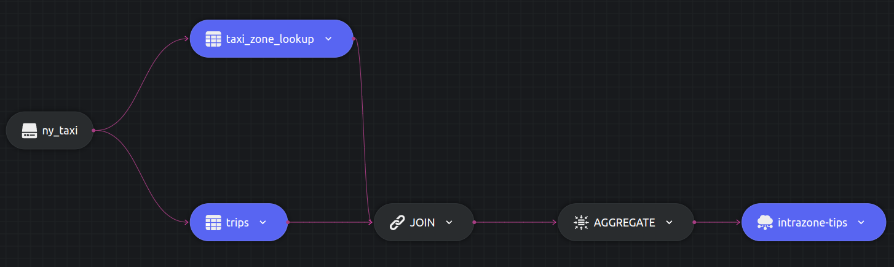

# Join example

This example shows how to JOIN two sources with Dozer. The two tables i.e. `taxi_zone_lookup` and `trips` can be JOINed over the `LocationID`.

Let us write a query to calculate the average `tips` for rides taken from a particular `Zone`. Afterwards we will order this to find the zones where the customers have higher chances of tipping a good amount. Additionally a `HAVING` clause is also added to filter out the results. 

## SQL Query and Structure

```sql
  SELECT zp.Zone, ROUND(AVG(t.tips),2) as avg_tips, COUNT(1) as trip_count
  INTO table1
  FROM trips t
  JOIN taxi_zone_lookup zp ON t.PULocationID = zp.LocationID
  GROUP BY zp.Zone
  HAVING ROUND(AVG(t.tips),2) > 1.50;
```




## Running


### Dozer

To run Dozer navigate to the join folder `/sql/join` & use the following command

```bash
dozer run
```

To remove the cache directory, use

```bash
dozer clean
```


### Dozer Live

To run with Dozer live, replace `run` with `live`

```bash
dozer live
```

Dozer live automatically deletes the cache upon stopping the program.


## Querying Dozer 

Dozer API lets us use `filter`,`limit`,`order_by` and `skip` at the endpoints. For this example lets order the data in descending order of avg_tips.

Execute the following commands over bash to get the results from `REST` and `gRPC` APIs.

**`REST`**

```bash
curl -X POST  http://localhost:8080/intrazone-trips/query \
--header 'Content-Type: application/json' \
--data-raw '{"$order_by": {"avg_tips": "desc"}}'
```

**`gRPC`**

```bash
grpcurl -d '{"endpoint": "intrazone-tips", "query": "{\"$order_by\": {\"avg_tips\": \"desc\"}}"}' \
-plaintext localhost:50051 \
dozer.common.CommonGrpcService/query
```