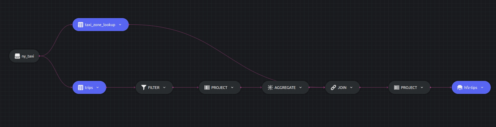

# Sub queries example

This example shows how to write nested sub queries.

Let us write a query to calculate the average `tips` for rides taken from a particular `Zone`. The outermost query JOINs the `taxi_zone_lookup` with a nested subquery `hfz` which does the job of filtering and grouping the `trips` table. `hfz` contains another sub query which ensures prior filtering of license plates that end with 3.  

## SQL Query and Structure

```sql
SELECT tzl.Zone, hfz.avg_tips, hfz.trip_count
 INTO table1
 FROM taxi_zone_lookup tzl
 JOIN (
   SELECT PULocationID, COUNT(1) AS trip_count, AVG(tips) AS avg_tips
   FROM (
    SELECT PULocationID, tips
    FROM trips
    WHERE hvfhs_license_num LIKE '%3'
   )
   GROUP BY PULocationID
   HAVING COUNT(1) > 100 AND AVG(tips) > 1.00
 ) hfz ON tzl.LocationID = hfz.PULocationID
```




## Running


### Dozer

To run Dozer navigate to the join folder `/sql/sub-queries` & use the following command

```bash
dozer run
```

To remove the cache directory, use

```bash
dozer clean
```


### Dozer Live

To run with Dozer live, replace `run` with `live`

```bash
dozer live
```

Dozer live automatically deletes the cache upon stopping the program.


## Querying Dozer 

Dozer API lets us use `filter`,`limit`,`order_by` and `skip` at the endpoints. For this example lets order the data in descending order of `avg_tips`.

Execute the following commands over bash to get the results from `REST` and `gRPC` APIs.

**`REST`**

```bash
curl -X POST  http://localhost:8080/hfz-trips/query \
--header 'Content-Type: application/json' \
--data-raw '{"$order_by": {"avg_tips": "desc"}}'
```

**`gRPC`**

```bash
grpcurl -d '{"endpoint": "hfz-tips", "query": "{\"$order_by\": {\"avg_tips\": \"desc\"}}"}' \
-plaintext localhost:50051 \
dozer.common.CommonGrpcService/query
```
