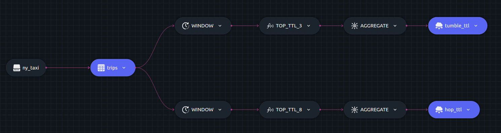

# TTL function example

This example shows how to use the Time To Live(TTL) function using Dozer SQL.

The TTL function provides a way to manage the memory usage in Dozer, particularly when dealing with vast streams of data. By setting up a TTL, it ensures that only relevant (or recent) data is held in memory, providing a balance between data retention and memory efficiency. TTL is based on the record's timestamp, ensuring that data eviction is contextually relevant.

To read more about window functions read the [documentation](https://getdozer.io/docs/transforming-data/windowing#ttl).

Here we describe two queries that will only use fresh data obtained over a 5 minute window,

- Query to calculate the sum of tips obtained for a particular Pickup location over a 2 minutes window.

- Query to calculate the sum of tips obtained for a particular Pickup location over a 3 minutes window but the windows overlap by 1 minutes.
  i.e. the 3 minutes is divided into,
  - 1 minutes overlapping with past window
  - 1 minute non overlapping
  - 1 minutes overlapping with next window

## SQL Query and Structure

### Query 1

```sql
  SELECT t.PULocationID as location, SUM(t.tips) AS total_tips, t.window_start as start, t.window_end AS end
  INTO table1
  FROM TTL(TUMBLE(trips, pickup_datetime, '2 MINUTES'), pickup_datetime, '5 MINUTES') t
  GROUP BY t.PULocationID, t.window_start, t.window_end;
```

### Query 2

```sql
  SELECT t.PULocationID as location, SUM(t.tips) AS total_tips, t.window_start as start, t.window_end AS end
  INTO table2
  FROM TTL(HOP(trips, pickup_datetime, '1 MINUTE', '3 MINUTES'), pickup_datetime, '5 MINUTES') t
  GROUP BY t.PULocationID, t.window_start, t.window_end;
```



## Running

### Dozer

To run Dozer navigate to the join folder `/sql/ttl` & use the following command

```bash
dozer run
```

To remove the cache directory, use

```bash
dozer clean
```

### Dozer Live

To run with Dozer live, replace `run` with `live`

```bash
dozer live
```

Dozer live automatically deletes the cache upon stopping the program.

## Querying Dozer

Dozer API lets us use `filter`,`limit`,`order_by` and `skip` at the endpoints. For this example lets order the data in descending order of the sum of `tips`.

Execute the following commands over bash to get the results from `REST` and `gRPC` APIs.

### Query 1

**`REST`**

```bash
curl -X POST  http://localhost:8080/tumble_ttl/query \
--header 'Content-Type: application/json' \
--data-raw '{"$order_by": {"total_tips": "desc"}}'
```

**`gRPC`**

```bash
grpcurl -d '{"endpoint": "tumble_ttl", "query": "{\"$order_by\": {\"total_tips\": \"desc\"}}"}' \
-plaintext localhost:50051 \
dozer.common.CommonGrpcService/query
```

### Query 2

**`REST`**

```bash
curl -X POST  http://localhost:8080/hop_ttl/query \
--header 'Content-Type: application/json' \
--data-raw '{"$order_by": {"total_tips": "desc"}}'
```

**`gRPC`**

```bash
grpcurl -d '{"endpoint": "hop_ttl", "query": "{\"$order_by\": {\"total_tips\": \"desc\"}}"}' \
-plaintext localhost:50051 \
dozer.common.CommonGrpcService/query
```
