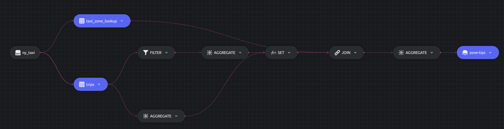

# Union example

This example shows how to use the `UNION` clause in Dozer SQL.

Let us write a query to calculate the average `tips` and total trips for a particular `Zone`. Here we are considering the ride to be taken in a `Zone` if either of the Pickup Location or Dropoff Location match the Zone, which requries the use of `UNION`. The `UNION` is taken inside a CTE `all_trips` which is then joined with `taxi_zone_lookup`.

## SQL Query and Structure

```sql
WITH all_trips AS (
    SELECT PULocationID as LocationID, SUM(tips) AS sum_tip, COUNT(1) AS total_count
    FROM trips
    WHERE PULocationID != DOLocationID
    GROUP BY PULocationID
    HAVING COUNT(1) > 100 AND AVG(tips) > 1.00

    UNION

    SELECT DOLocationID as LocationID, SUM(tips) AS sum_tip, COUNT(1) AS total_count
    FROM trips
    GROUP BY DOLocationID
    HAVING COUNT(1) > 100 AND AVG(tips) > 1.00
  )
  SELECT tzl.Zone, SUM(sum_tip)/SUM(total_count) AS avg_tips, SUM(total_count) AS trip_count
  INTO table1
  FROM taxi_zone_lookup tzl
  JOIN all_trips at ON tzl.LocationID = at.LocationID
  GROUP BY tzl.Zone;
```




## Running


### Dozer

To run Dozer navigate to the join folder `/sql/union` & use the following command

```bash
dozer run
```

To remove the cache directory, use

```bash
dozer clean
```


### Dozer Live

To run with Dozer live, replace `run` with `live`

```bash
dozer live
```

Dozer live automatically deletes the cache upon stopping the program.


## Querying Dozer 

Dozer API lets us use `filter`,`limit`,`order_by` and `skip` at the endpoints. For this example lets order the data in descending order of `avg_tips`.

Execute the following commands over bash to get the results from `REST` and `gRPC` APIs.

**`REST`**

```bash
curl -X POST  http://localhost:8080/zone-tips/query \
--header 'Content-Type: application/json' \
--data-raw '{"$order_by": {"avg_tips": "desc"}}'
```

**`gRPC`**

```bash
grpcurl -d '{"endpoint": "zone-tips", "query": "{\"$order_by\": {\"avg_tips\": \"desc\"}}"}' \
-plaintext localhost:50051 \
dozer.common.CommonGrpcService/query
```
