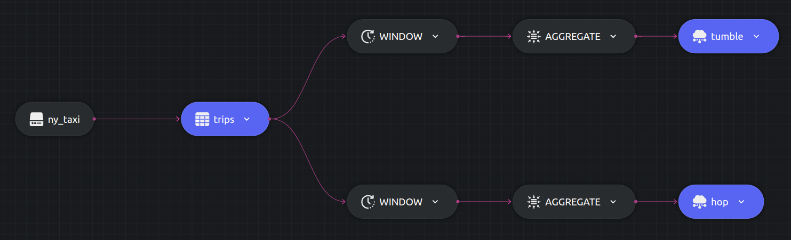

# Window function example

This example shows how to use the `TUMBLE` and `HOP` functions using Dozer SQL. These functions are often useful with real time analytics over vast streams of incoming data. To read more about window functions read the [documentation](https://getdozer.io/docs/transforming-data/windowing).

Here we describe two queries,
- Query to calculate the sum of tips obtained for a particular Pickup location over a 5 minutes window. `TUMBLE` will help us do the same.

- Query to calculate the sum of tips obtained for a particular Pickup location over a 5 minutes window but the windows overlap by 2 minutes, i.e. the 5 minutes are divided into 2 minutes overlapping with past window, 1 minute non overlapping and 2 minutes overlapping with next window. `HOP` will help us do the same.

## SQL Query and Structure

### Query 1

```sql
  SELECT t.PULocationID as location, SUM(t.tips) AS total_tips, t.window_start as start, t.window_end AS end
  INTO table1
  FROM TUMBLE(trips, pickup_datetime, '5 MINUTES') t
  GROUP BY t.PULocationID, t.window_start, t.window_end;
```

### Query 2

```sql
  SELECT t.PULocationID as location, SUM(t.tips) AS total_tips, t.window_start as start, t.window_end AS end
  INTO table2
  FROM HOP(trips, pickup_datetime, '2 MINUTE', '5 MINUTES') t
  GROUP BY t.PULocationID, t.window_start, t.window_end;
```





## Running


### Dozer

To run Dozer navigate to the join folder `/sql/window-functions` & use the following command

```bash
dozer run
```

To remove the cache directory, use

```bash
dozer clean
```


### Dozer Live

To run with Dozer live, replace `run` with `live`

```bash
dozer live
```

Dozer live automatically deletes the cache upon stopping the program.


## Querying Dozer 

Dozer API lets us use `filter`,`limit`,`order_by` and `skip` at the endpoints. For this example lets order the data in descending order of the sum of `tips`.

Execute the following commands over bash to get the results from `REST` and `gRPC` APIs.

### Query 1

**`REST`**

```bash
curl -X POST  http://localhost:8080/tumble/query \
--header 'Content-Type: application/json' \
--data-raw '{"$order_by": {"total_tips": "desc"}}'
```

**`gRPC`**

```bash
grpcurl -d '{"endpoint": "tumble", "query": "{\"$order_by\": {\"total_tips\": \"desc\"}}"}' \
-plaintext localhost:50051 \
dozer.common.CommonGrpcService/query
```

### Query 2

**`REST`**

```bash
curl -X POST  http://localhost:8080/hop/query \
--header 'Content-Type: application/json' \
--data-raw '{"$order_by": {"total_tips": "desc"}}'
```

**`gRPC`**

```bash
grpcurl -d '{"endpoint": "hop", "query": "{\"$order_by\": {\"total_tips\": \"desc\"}}"}' \
-plaintext localhost:50051 \
dozer.common.CommonGrpcService/query
```