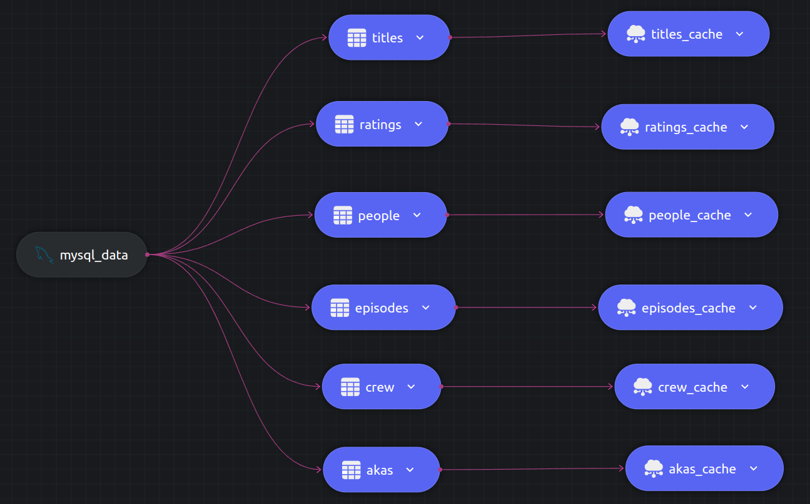

## IMDB - Analytics

In this example we demonstrate Dozer's capabilities to find meaningful insights by processing large amounts of data. 

## Data Schema and Volume

The dataset used here is taken from [CMU 15-445/645 Coursework](https://15445.courses.cs.cmu.edu/fall2022/homework1/) which also has many examples of interesting SQL queries.

For this example we are loading the data into a MySQL database. Steps to do the same can be found [here](./running.md).


 The dataset has six tables: `akas` , `crew` , `episodes` , `people` , `ratings` , `title`, with roughly 17 million data records in total.

| Table       | No of Rows  |
| ----------- | ----------- |
| akas        | 4_947_919   |
| crew        | 7_665_208   |
| episodes    |  157_869    |
| people      | 1_782_303   |
| ratings     |  188_159    |
| title       | 1_375_462   |

## Hardware Configuration

|      CPU       | Cores |   Memory   |
| -------------- | ----- | ---------- |
| Ryzen7 4800H   |  16   |    16GB    |

## Experiment 1 lorem ipsum

Running `dozer` direct from `source` to `cache`.

## Instructions
```
dozer clean -c direct-config.yaml
dozer build -c direct-config.yaml
dozer run app -c direct-config.yaml
```

## Findings



 - Roughly took `4 mins` to process all the records.
 - Note that processing of `customers`, `orders` and `order_items` finished in about `2 mins` compared to `products`.
 - Pipeline latency is very low (`~0.04`) as there is no transformation involved.

| Start Time | End Time   | Elapsed  |
| ---------- | ---------- | -------- |
| 3:00:50 PM | 3:04:38 PM | ~ 4 mins |

## Experiment 2 lorem ipsum

Running `dozer` with aggregations and joins.

We run 3 cascading JOINs and a COUNT aggregation on the data source. The sql can be found in [`join-config.yaml`](./join-config.yaml).

```sql
select c.customer_id, c.name, c.email,  o.order_id, o.order_date, o.total_amount, COUNT(*)
  into customer_orders 
  from customers c
  inner join orders o on c.customer_id = o.customer_id
  join order_items i on o.order_id = i.order_id
  join products p on i.product_id = p.product_id
  group by c.customer_id, c.name, c.email, o.order_id, o.order_date, o.total_amount
```

### Instructions
```
dozer clean -c join-config.yaml
dozer build -c join-config.yaml
dozer run app -c join-config.yaml
```

### Findings


 - Roughly took `12 mins` to process all the records. 
 - Note that here total number of `order_items` increases in conjunction with `products`. This is to due to the dependency of the join. 
 - Pipeline latency stays under `1s` even with 4 joins and an aggregation.
 
| Start Time | End Time   | Elapsed   |
| ---------- | ---------- | --------- |
| 2:32:48 PM | 2:44:51 PM | ~ 12 mins |

## Experiment 3 lorem ipsum

Running `dozer` with multiple cte defined as well as multiple aggregation and join operations.

We run 3 cascading JOINs and a COUNT aggregation on the data source. The sql can be found in [`cte-config.yaml`](./cte-config.yaml).

```sql
select c.customer_id, c.name, c.email,  o.order_id, o.order_date, o.total_amount, COUNT(*)
  into customer_orders 
  from customers c
  inner join orders o on c.customer_id = o.customer_id
  join order_items i on o.order_id = i.order_id
  join products p on i.product_id = p.product_id
  group by c.customer_id, c.name, c.email, o.order_id, o.order_date, o.total_amount
```

### Instructions
```
dozer clean -c cte-config.yaml
dozer build -c cte-config.yaml
dozer run app -c cte-config.yaml
```

### Findings


 - Roughly took `12 mins` to process all the records. 
 - Note that here total number of `order_items` increases in conjunction with `products`. This is to due to the dependency of the join. 
 - Pipeline latency stays under `1s` even with 4 joins and an aggregation.
 
| Start Time | End Time   | Elapsed   |
| ---------- | ---------- | --------- |
| 2:32:48 PM | 2:44:51 PM | ~ 12 mins |