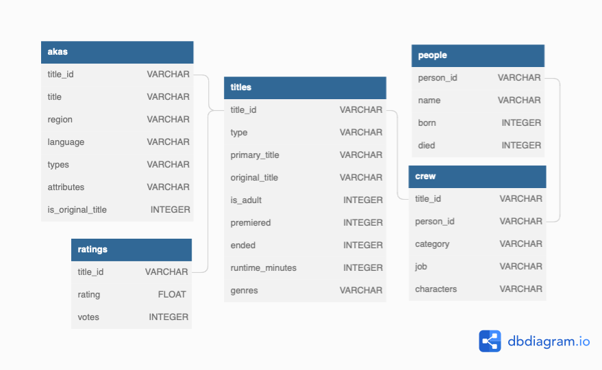

# IMDB - Analytics

In this example we demonstrate Dozer's capabilities to find meaningful insights by processing large amounts of data. 

## Data Schema and Volume

The dataset used here is taken from [CMU 15-445/645 Coursework](https://15445.courses.cs.cmu.edu/fall2022/homework1/) which also has many ideas for interesting SQL queries.

For this example we are loading the data into a MySQL database. Steps to do the same can be found [here](./description_files/running.md).

 The dataset has six tables: `akas` , `crew` , `episodes` , `people` , `ratings` , `title`, with roughly 17 million data records in total.

| Table       | No of Rows  |
| ----------- | ----------- |
| akas        | 4_947_919   |
| crew        | 7_665_208   |
| episodes    |  157_869    |
| people      | 1_782_303   |
| ratings     |  188_159    |
| title       | 1_375_462   |

## Hardware Configuration

|      CPU       | Cores |   Memory   |
| -------------- | ----- | ---------- |
| Ryzen7 4800H   |  16   |    16GB    |

It is also important to note, the experiments are being run on a NVMe SSD which offers higher read speed than conventional SATA storage systems.

## Experiments

In this section we perform various experiments with different configuration files and analyze their performance results.

| Sr.no |   Experiment   | Aggregations |  JOINs  |   CTEs  |                  Description                     |
| ------| -------------- | ----------- | ------- | ------- | ------------------------------------------------ |
|   1   | [No ops](./description_files/experiment1.md) |      0      |    0    |    0    | Running directly from source to cache      |
|   2   | [Double JOIN](./description_files/experiment2.md) |      1      |    2    |    0    | Running with one JOIN operation            |
|   3   | [Multiple JOINs](./description_files/experiment3.md) |      0      |    3    |    0    | Running with three JOIN operations         |
|   4   | [CTE & JOIN](./description_files/experiment4.md) |      0      |    1    |    1    | Running with a CTE and a join operation    |
|   5   | [Multiple ops](./description_files/experiment5.md) |      0      |    5    |    2    | Running with multiple CTEs and JOINs       |