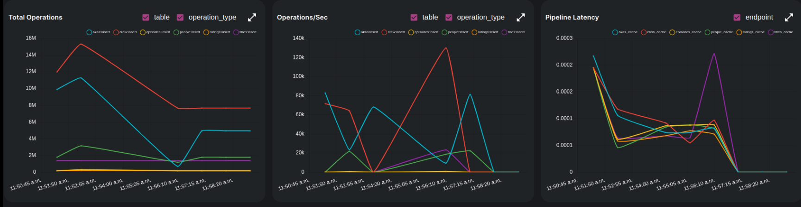

# IMDB - Analytics

## Experiment 1

Running `dozer` direct from `source` to `cache`. The config file can be found [here](../exp1-config.yaml)


## Instructions
```
dozer clean -c exp1-config.yaml
dozer build -c exp1-config.yaml
dozer run app -c exp1-config.yaml
```

## Findings



 - Roughly took `7 mins` to process all the records.
 - Pipeline latency is very low (`~0.0002`) as there is no transformation involved.

| Start Time  | End Time    | Elapsed  |
| ----------- | ----------- | -------- |
| 11:51:23 AM | 11:58:04 PM | ~ 7 mins |

[Click here](../README.md) to go back to homepage.