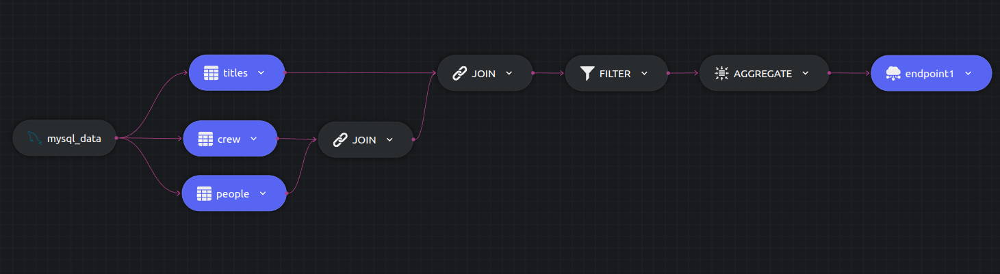

# IMDB - Analytics

## Experiment 2

Finding the actors and actresses with the most movies.

We run 2 cascading JOINs and a COUNT aggregation on the data source. The config file be found [here](../exp2-config.yaml).

```sql
 select p.name, c.category, count(1) as titles
 into endpoint1
 from people p 
 join crew c on p.person_id = c.person_id  
 join titles t on t.title_id = c.title_id  
 where c.category = 'actor' or c.category = 'actress'
 group by p.name,c.category;
```



### Instructions
```
dozer clean -c exp2-config.yaml
dozer build -c exp2-config.yaml
dozer run app -c exp2-config.yaml
``` 

Dozer should start running after executing the commands, but ordering the data is still left! Dozer API provides the option to add query such as `order by`, `limit` and many more... to improve the visibility of the data on the endpoints.

The query described can be passed to the REST endpoints `GET:localhost:8080/endpoint1` to order the data in descending order w.r.t `titles`.
```json
{
  "order_by":{"titles":"desc"}
}
```

### Findings


 - Roughly took `2 mins` to process all the records. 
 - Exp 2 took less time than Exp 1 even with a sql operation. This can be attributed to three reasons,
   - Less store operations due to one endpoint and less data outputted `103734` rows to be exact.
   - Less read operations from source due to data being read from three tables.
   - Excellent pipline latency even with 2 joins and an aggregation. 
 - Pipeline latency stays under `0.25s` even with 2 joins and an aggregation.
 
| Start Time | End Time   | Elapsed   |
| ---------- | ---------- | --------- |
| 1:20:36 PM | 1:22:12 PM | ~ 2 mins  |