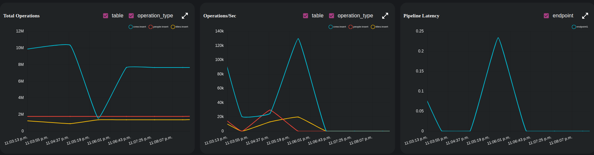
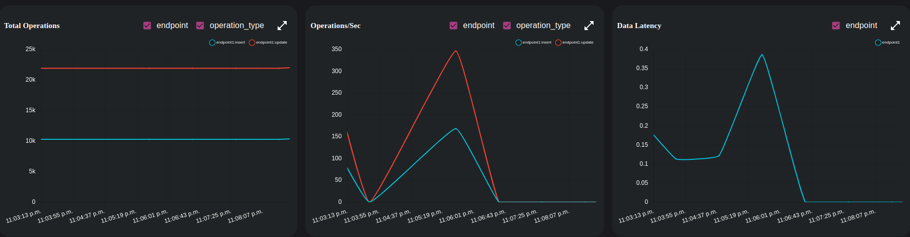

# IMDB - Analytics

## Experiment 3

Finding the actors and actresses with the most action movies.

Dozer SQL provides us with CTEs which can improve readability, as well as the option to reuse the same query multiple times.

We can use a similar approach as used in the [previous example](./experiment2.md), or use CTEs as described. The config file can be found [here](../exp3-config.yaml).

```sql
 with acting_crew as (
  select person_id, category
  from crew
  where category = 'actor' or category = 'actress'
 ),
 
 action_titles as (
  select title_id
  from titles
  where genres like '%Action%'
 )
 
 select p.name, r.category, count(1) as titles
 into out_table
 from people p 
 join acting_crew r on p.person_id = r.person_id  
 join action_titles a on a.title_id = r.title_id  
 group by p.name,r.category;
```


### Instructions
```
dozer clean -c exp3-config.yaml
dozer build -c exp3-config.yaml
dozer run -c exp3-config.yaml
```

Dozer should start running after executing the commands, but ordering the data is still left! Dozer API provides the option to add query such as `order by`, `limit` and many more... to improve the visibility of the data on the endpoints.

The query described can be passed to the REST endpoints `GET:localhost:8080/endpoint1` to order the data in descending order w.r.t `titles`.
```json
{
  "order_by":{"titles":"desc"}
}
```

### Findings

#### Source


#### Stores


 - Roughly took `2 mins` to process all the records. 
 - Took about the same time as Exp2 since the same data was ingested.
 - Pipeline latency stayed under `0.25s`.
 
| Start Time  | End Time   | Elapsed    |
| ----------- | ---------- | ---------- |
| 11:04:40 PM | 11:06:34 PM | ~ 2 mins  |

[Click here](../README.md) to go back to homepage.