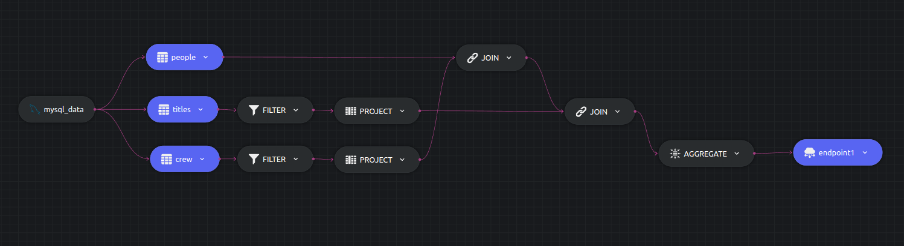
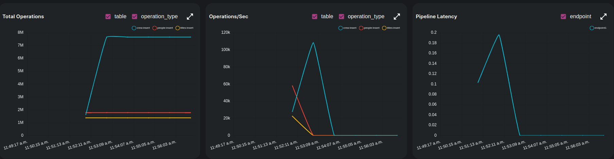

# IMDB - Analytics

## Experiment 3

Finding the actors and actresses with the most ACTION movies.

Dozer SQL provides us with CTEs which can improve readability as well as possibly improve performance by truncating the data before JOINs happen.

We can use a similar approach as used in the [previous example](./experiment2.md), or use CTEs as described.

```sql
 with reduced_crew as (
  select person_id
  from crew
  where category = 'actor' or category = 'actress'
 )
 with action_titles as (
  select title_id
  from titles
  where genres like '%Action%'
 )
 select p.name, r.category, count(1) as titles
 into endpoint1
 from people p 
 join reduced_crew r on p.person_id = r.person_id  
 join action_titles a on a.title_id = r.title_id  
 group by p.name,c.category;
```
 
The sql can also be found in [`join-config.yaml`](../join-config.yaml).



### Instructions
```
dozer clean -c exp3-config.yaml
dozer build -c exp3-config.yaml
dozer run app -c exp3-config.yaml
```

### Findings



 - Roughly took `2 mins` to process all the records. 
 - Exp 2 took less time than Exp 1 even with a sql operation. This can be attributed to two reasons,
   - Less store operations due to one endpoint and less data outputted `103734` rows to be exact.
   - Less read operations from source due to data being read from three tables. 
 - Pipeline latency stays under `0.25s` even with 2 joins and an aggregation.
 
| Start Time | End Time   | Elapsed   |
| ---------- | ---------- | --------- |
| 1:20:36 PM | 1:22:12 PM | ~ 2 mins  |