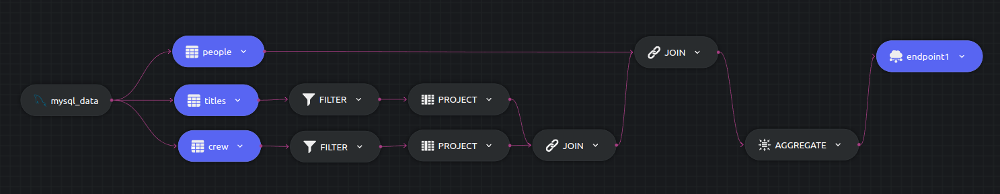

#IMDB - Analytics

## Experiment 4

Lets try out the [previous experiment](./experiment3.md) using sub queries instead of CTEs.

Find the actors and actresses with the most action movies.

We use two subqueries to filter out the tables before joining all of them. The config file can be found [here](../exp4-config.yaml).

```sql
 SELECT p.name, r.category, COUNT(1) AS titles
 INTO out_table
 FROM (   
 SELECT person_id, category, title_id   
 FROM crew   
 WHERE category = 'actor' OR category = 'actress'
 ) r
 JOIN (   
 SELECT title_id  
 FROM titles   
 WHERE genres LIKE '%Action%'
 ) a ON a.title_id = r.title_id
 JOIN people p ON p.person_id = r.person_id 
 GROUP BY p.name, r.category;
```



### Instructions
```
dozer clean -c exp4-config.yaml
dozer build -c exp4-config.yaml
dozer run app -c exp4-config.yaml
```

Dozer should start running after executing the commands, but ordering the data is still left! Dozer API provides the option to add query such as `order by`, `limit` and many more... to improve the visibility of the data on the endpoints.

The query described can be passed to the REST endpoints `GET:localhost:8080/endpoint1` to order the data in descending order w.r.t `titles`.
```json
{
  "order_by":{"titles":"desc"}
}
```

### Findings

#### Source


#### Stores


 - Roughly took `2 mins` to process all the records. 
 - The number of store operations are very much similar to Exp3.
 - Pipeline latency stayed under `0.1s`.
 
| Start Time  | End Time   | Elapsed    |
| ----------- | ---------- | ---------- |
| 11:30:54 PM | 11:32:49 PM | ~ 2 mins  |