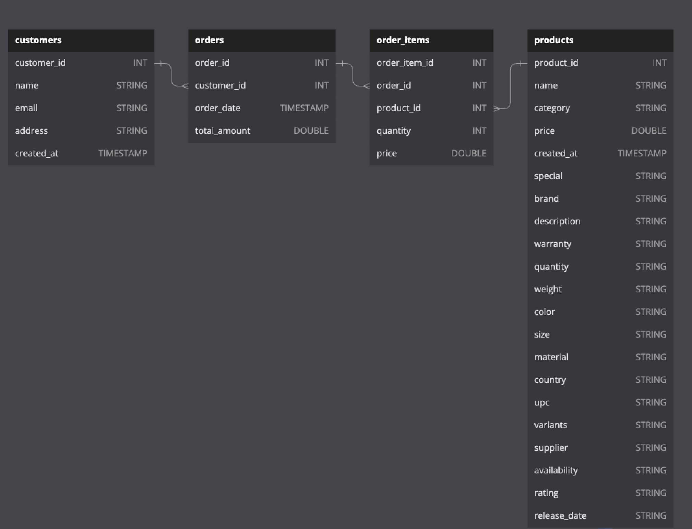
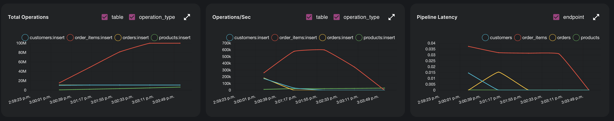
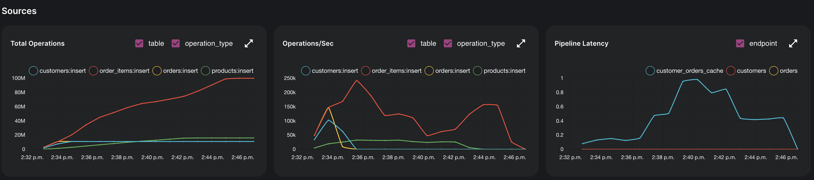

# Scaling E-Commerce

In this example we demonstrate Dozer's capability of processing large volume of data.

Running instructions can be [found here](./running.md)
## Data Schema and Volume

Let's consider the following schema. The data source has 4 tables: `orders`, `order_items`, `products`, `customers`. 



Data has been generated using `dbldatagen`. 
We generate 11 million rows for customers, 11 million rows for orders, 10 million rows for products, and 100 million rows for order_items. These parameters can be adjusted in [`generate.py`](./generate.py).

| Table       | No of Rows  |
| ----------- | ----------- |
| customers   | 11_000_000  |
| orders      | 11_000_000  |
| order_items | 100_000_000 |
| products    | 16_000_000  |

Following tests have been run on AWS Graviton `m7g.8xlarge` type.
| Instance Type | vCPUs | Memory(Gb) |
| ------------- | ----- | ---------- |
| m7g.8xlarge   | 32    | 128        |


## Experiment 1

Running `dozer` direct from `source` to `cache`.

### Instructions
```
dozer clean -c direct-config.yaml
dozer build -c direct-config.yaml
dozer run app -c direct-config.yaml
```

#### Findings



 - Roughly took `7 mins` to process all the records. 
 - Note that processing of `customers`, `orders` and `order_items` finished in about `3 mins` compared to `products`.
 - Pipeline latency is very low (`~0.35`) as there is no transformation involved.
 
| Start Time | End Time   | Elapsed  |
| ---------- | ---------- | -------- |
| 1:53:21 PM | 2:02:38 PM | ~ 7 mins |


## Experiment 2

Running `dozer` with aggregations and joins.

We run 3 cascading JOINs and a COUNT aggregation on the data source. The sql can be found in [`aggregate-config.yaml`](./aggregate-config.yaml).

```sql
select c.customer_id, c.name, c.email,  o.order_id, o.order_date, o.total_amount, COUNT(*)
  into customer_orders 
  from customers c
  inner join orders o on c.customer_id = o.customer_id
  join order_items i on o.order_id = i.order_id
  join products p on i.product_id = p.product_id
  group by c.customer_id, c.name, c.email, o.order_id, o.order_date, o.total_amount
```

### Instructions
```
dozer clean -c aggregate-config.yaml
dozer build -c aggregate-config.yaml
dozer run app -c aggregate-config.yaml
```


#### Findings



 - Roughly took `12 mins` to process all the records. 
 - Note that here total number of `order_items` increases in conjunction with `products`. This is to due to the dependency of the join. 
 - Pipeline latency stays under `1s` as there is no transformation involved.
 
| Start Time | End Time   | Elapsed   |
| ---------- | ---------- | --------- |
| 2:32:48 PM | 2:44:51 PM | ~ 12 mins |
